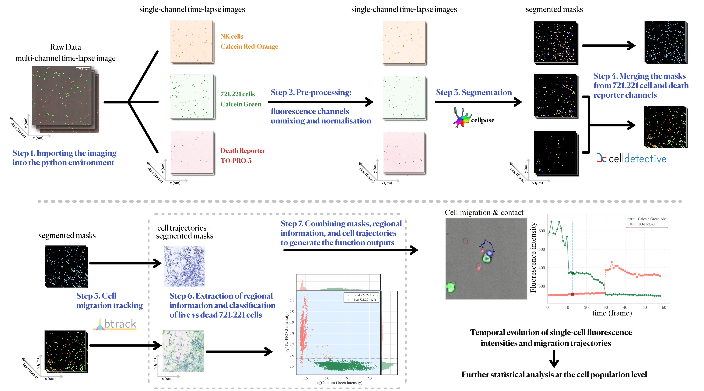

# CytotoxicVision

This repository provides a complete for analysing time-lapse fluorescence microscopy data of NK cell interactions with 721.221 target cells. The workflow integrates cell segmentation, tracking, fluorescence quantification, and contact analysis. The implementation leverages Cellpose, CellDetective, and btrack to extract biologically meaningful features at the single-cell and population level.

##  Workflow Steps

